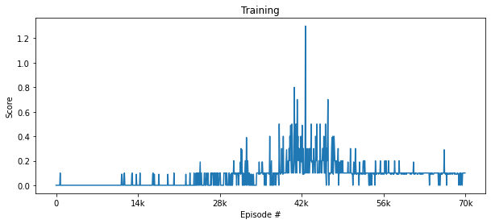
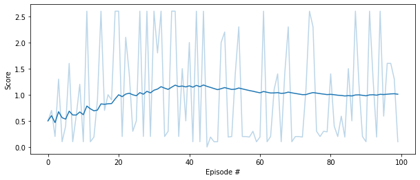

## Report

---

### Algorithm

To solve the problem, the algorithm Deep Deterministic Policy Gradient for Continuous Action-space [DDPG](https://arxiv.org/abs/1509.02971) was applied. The implementation is based on the Udacity [DDPG project](https://github.com/udacity/deep-reinforcement-learning/tree/master/ddpg-bipedal), which has been adapted to the multi-agent approach.

The Multi-Agent contains 2 separate DDPG agents, each of which controls one of the 2 rockets and receives its own, local observation, but shares the same replay buffer. These agents have the same model architecture of actor and critic.

Actor and critic have 3 hidden layers:

- 512 units hidden layer with ReLU activation
- 256 units hidden layer with ReLU activation
- 512 units hidden layer with ReLU activation

The hyper parameters are:

- buffer size: 1000000
- batch size: 512       
- discount factor (gamma): 0.99           
- soft update factor (tau): 0.2            
- learning rate for both nets: 0.0001    
- train steps: 20

### Training

The following diagram shows scores during training:

According to the diagram, the environment was solved after 42k episodes.

### Evaluation

The average score reaches about 1.0 (over 100 consecutive episodes, after taking the maximum over both agents)

### Future Work

- The training scores indicates that OU noise strategy is not the optimal way to explore the environment, so an another one may improve training.
- Importance sampling for replay buffer may also improve stability.